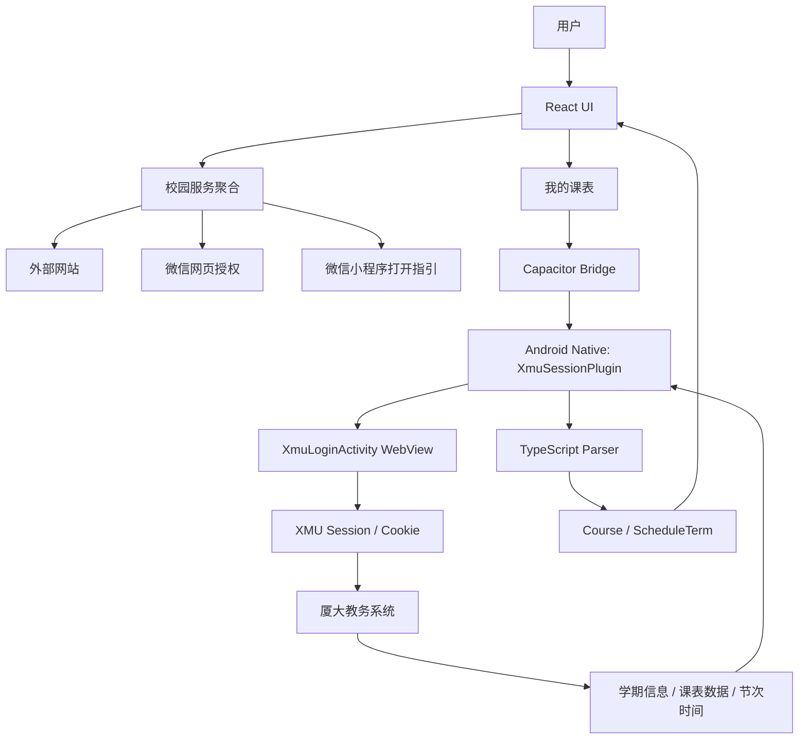

# 厦大校园 Hub

**XMU Campus Hub**

一个面向厦门大学学生的校园服务聚合与个人课表 App，将分散的教务、校园、资源和生活服务整合到一个统一入口，并通过厦大官方认证流程获取个人课表。

---

## ✨ 项目简介

### 项目目的

学校服务分散在多个网站、认证入口和微信生态中。厦大校园 Hub 希望减少用户寻找入口的成本，把常用校园服务集中到一个清晰的界面中，同时提供一个 Android 端的个人课表入口。

### 解决的问题

- 集中查找教务、选课、图书馆、校园事务和生活服务
- 记录本设备上的网站服务使用次数，优先展示常用入口
- 将微信小程序、微信网页授权服务与普通网站服务区分开，明确实际打开方式
- 通过厦大官方登录页面完成认证，并在 Android WebView 中保留合法的登录 Session
- 将教务系统返回的课表数据转换为可展示的课程、周次和节次模型

### 当前开发状态

当前项目处于 **开发与真机测试阶段**：

- React Web UI 与校园服务聚合已经实现
- Android Capacitor 工程与 Debug APK 构建链已经建立
- 厦大官方 WebView 登录、Session 验证和课表读取链路已经实现
- 课表解析、周次处理和课表展示已经实现
- 真机 WebView 兼容性、教务接口变化和长期稳定性仍需持续验证
- 当前仅提供 Android Debug 构建，不包含正式 Release 签名配置

---

## ✨ 当前功能

### 🏫 校园服务聚合

服务数据集中在 `src/data/services.ts`，当前包含 10 个真实入口，并按“学习、校园、生活”分类。

#### 学习

| 服务 | 类型 | 当前入口 |
| --- | --- | --- |
| 教务系统 | 网站 | `https://jw.xmu.edu.cn/` |
| 选课系统 | 网站 | `https://xk.xmu.edu.cn/` |
| 教务处 | 网站 | `https://jwc.xmu.edu.cn/` |
| 数字化教育平台 | 网站 | `https://c-mobile.xmu.edu.cn/` |
| 图书馆 | 网站 | `https://library.xmu.edu.cn/` |

“数字化教育平台”的服务关键词包含签到、考勤和打卡；图书馆入口包含馆藏、借阅和数字资源。

#### 校园

| 服务 | 类型 | 当前入口 |
| --- | --- | --- |
| 信息门户 | 网站 | `https://i.xmu.edu.cn/` |
| 学生服务平台 | 网站 | `https://xmuxg.xmu.edu.cn/platform` |

“学生服务平台”的数据关键词包含假期、离校、留校和登记。当前 App 提供平台入口，不内嵌或复制学校平台自身的登记表单。

#### 搜索与分类

- 支持按服务名称、描述和关键词实时搜索
- 支持“全部服务、学习、校园、生活”分类筛选
- 搜索无结果时显示可恢复的空状态
- 网站服务使用次数保存在当前浏览器或 WebView 的 `localStorage`
- 按使用次数和最近使用时间展示最多 4 个常用网站服务

#### 外部网站打开方式

- Web 端使用新标签页打开
- Android 端使用 Capacitor Browser 打开
- 网站不在 Hub 页面中内嵌，避免 iframe、Cookie、登录状态和第三方页面限制

### 📱 微信相关服务

当前代码中的微信相关服务不是“直接嵌入微信小程序”。App 会根据服务类型显示准确的打开方式。

| 服务 | 类型 | 当前打开方式 |
| --- | --- | --- |
| 场馆预约 / 厦大体育 | 微信小程序 | 显示小程序名称和官方分享入口，由用户在微信中打开；当前不提供一键直跳 |
| 厦门大学快递服务中心 | 微信网页授权服务 | 打开微信官方 OAuth 网页授权入口，由微信和服务方完成授权 |
| 宿舍热水 | 微信小程序 | 显示小程序二维码，由微信扫码打开 |

小程序弹窗支持复制小程序名称。“宿舍热水”使用 `public/miniprograms/dormitory-hot-water.jpg` 中的二维码资源。

### 📚 我的课表

#### 官方认证与 Session

- Android 端通过 `XmuLoginActivity` 打开厦大官方教务登录入口
- 用户在厦大官方页面中完成学号、密码、验证码或 MFA 流程
- App 不绕过验证码或 MFA，也不提供代填、抓取密码或第三方代理登录
- 登录由 Android WebView 和 `CookieManager` 管理
- React 层不能读取或导出 Cookie、Token、CAS ticket 或官方页面正文
- `XmuSessionPlugin` 只暴露固定操作：打开官方登录、验证 Session、读取课表、清理 Session
- Session 验证只访问固定的教务课表入口，并根据最终跳转地址返回验证状态
- “清理认证 Session”会清理 WebView Cookie 和缓存，不显示 Cookie 内容

#### 教务数据读取

Android Native 使用已认证的 WebView Cookie 环境读取：

1. 当前学期信息
2. 学生课表数据
3. 教务节次时间

读取课表时需要用户输入本人学号，用于教务接口要求的 `XH` 查询字段。学号只保存在当前 App 进程内，不写入 `localStorage`，也不会由 Native 桥接返回给 React 长期存储。

#### TypeScript 课表解析

`src/lib/xmuScheduleParser.ts` 将教务返回数据转换为 `Course` 与 `ScheduleTerm`，当前支持：

- 周次位图解析
- 文本周次范围解析
- 单周
- 连续周范围
- 单周数 / 奇数周 / 双周
- 非连续周分段
- 多教师解析与去重
- 多教室解析与去重
- 周一至周日
- 连续多节课程跨节次展示
- 课程颜色分配
- 按星期、节次和周次排序

#### 课表界面

- 默认定位到当前周
- 支持上一周、下一周
- 支持刷新课表
- 展示周一至周日
- 展示教务节次时间
- 展示课程名、教室和教师信息
- Android 真实课表链路可用；纯 Web 环境不会尝试绕过 CORS 或学校认证限制

---

## 🛠️ 技术栈

### Web

- React 19
- TypeScript
- Vite 7
- Tailwind CSS 4
- Lucide React

### Android

- Capacitor 8
- Android
- Java
- Gradle 8.14.3
- Android Gradle Plugin 8.13.0

### 当前 Android 配置

- `minSdkVersion`: 24
- `compileSdkVersion`: 36
- `targetSdkVersion`: 36
- 应用 ID：`com.xmu.campushub`
- 页面容器：Capacitor WebView
- Native 认证与课表桥接：`XmuSessionPlugin`

---

## 🏗️ 项目架构



### 主要目录

```text
src/
├── components/       # 服务卡片、搜索、分类、导航、微信服务弹窗等 UI
├── context/          # Web 服务入口的登录确认状态
├── data/             # 服务、分类和课表测试数据
├── hooks/            # Hash 路由、服务使用统计
├── lib/              # 服务打开、搜索和课表解析
├── pages/            # 首页路由、登录、课表和 Session 验证页面
├── services/         # 外部链接、认证和 Native Session 服务
└── types/            # Service、Auth、Course 类型

android/app/src/main/java/com/xmu/campushub/
├── MainActivity.java
└── auth/
    ├── XmuLoginActivity.java
    ├── XmuScheduleClient.java
    └── XmuSessionPlugin.java
```

---

## 🚀 本地运行

### 环境要求

- Node.js 22 或更高版本
- npm
- Windows 构建 Android 时需要 JDK 21
- Android SDK Platform 36
- Android SDK Build-Tools 36
- Gradle Wrapper 8.14.3

当前开发环境使用 Node.js 24.20.0、npm 11.19.0 和 Temurin JDK 21。

### 安装依赖

```bash
npm install
```

### 启动 Web 开发服务

```bash
npm run dev
```

Vite 默认监听 `5173` 端口，并允许局域网访问。

### 类型检查

```bash
npm run typecheck
```

### 生产构建

```bash
npm run build
```

构建结果输出到 `dist/`。

### 预览生产构建

```bash
npm run preview
```

---

## 📱 Android 构建

### 同步 Web 构建结果

```bash
npm run cap:sync
```

该命令会执行 `npm run build`，然后将 `dist/` 同步到：

```text
android/app/src/main/assets/public/
```

### 构建 Debug APK

Windows：

```bat
npm run android:debug
```

或者进入 Android 目录执行：

```bat
cd android
gradlew.bat assembleDebug
```

构建前需要配置 `JAVA_HOME` 指向 JDK 21。

Debug APK 输出位置：

```text
android/app/build/outputs/apk/debug/app-debug.apk
```

`android/local.properties`、Debug 密钥和正式签名密钥均不提交到 Git。当前仓库不包含正式 Release 签名配置。

---

## 🔐 隐私与安全

- 网站服务使用次数只保存在当前浏览器或 WebView 的 `localStorage`
- 学号只在读取课表的当前 App 进程内使用
- 密码、验证码和 MFA 只在厦大官方页面中输入
- App 的 React / 业务层不读取或导出 Cookie、Token 或 CAS ticket；官方登录产生的 Session Cookie 只由 Android WebView `CookieManager` 管理
- Native 桥接不返回 Cookie、Token、官方页面正文或任意 URL 请求能力
- 不实现验证码绕过、MFA 绕过或第三方代理登录
- 项目当前没有业务后端；除向厦大官方教务接口提交本人学号用于课表查询外，不向第三方服务上传课表或学生信息

---

## ⚠️ 服务与认证说明

- 本项目是独立校园服务导航与个人课表工具，与厦门大学官方机构无隶属或背书关系
- 各网站、微信服务和教务接口的可用性以学校或服务提供方为准
- 教务接口或页面结构变化可能影响课表读取
- 选课系统等服务是否复用统一认证 Session，以对应服务自身的实际登录逻辑为准
- 微信小程序登录和授权由微信及小程序提供方管理
- 当前代码包含认证回调路由基础，但未接入已注册的官方回调服务，不将其视为已经完成的自动回调认证能力

---

## 📄 许可证

当前仓库尚未包含 `LICENSE` 文件，许可证尚未声明。